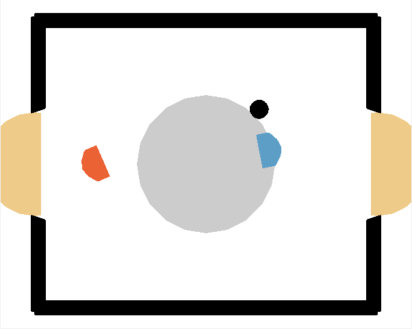

# laser-hockey-env

This repository contains two version of a hockey-like game

## Install

``python3 -m pip install git+https://github.com/martius-lab/laser-hockey-env.git``

or add the following line to your Pipfile

``laserhockey = {editable = true, git = "https://git@github.com/martius-lab/laser-hockey-env.git"}``

## HockeyEnv

``laserhockey.hockey_env.HockeyEnv``

A two-player (one per team) hockey environment.
For our Reinforcment Learning Lecture @ Uni-Tuebingen.
See Hockey-Env.ipynb notebook on how to run the environment.

The environment can be generated directly as an object or via the gym registry:

``env = gym.envs.make("Hockey-v0")``

There is also a version against the basic opponent (with options)

``env = gym.envs.make("Hockey-One-v0", mode=0, weak_opponent=True)``

## LaserHockeyEnv

A laser-hockey game implementation within openAI gym using the Box2D engine. It is quite a challenging environment
See Laser-Hockey-Env.ipynb notebook on how to run the environment.
